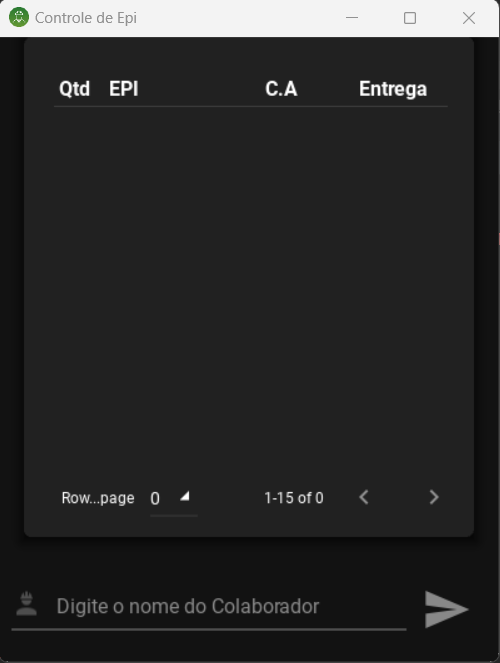

# Controle Epi

Aplicativo para Plataforma Android desenvolvido em Python e Kivymd, que permite a leitura do banco de dados em planilha excel, facilitando a consulta do banco de dados de Epis entregue pelo tecnico de segurança do trabalho durante suas inspenções em campo.

### Tecnologia
Aqui estão as tecnologias utilizadas neste projeto.

* Python 3
* KivyMd
* Pandas
* Numpy
* Excel

### Serviços Usados
* Github
* PyCharm

### Plataforma compatíveis
* Android

### Situação do Projeto
Projeto de software em andamento

### Interface

### Recursos
* Permite a leitura do banco de dados já alimentado em excel
* Auxiliar na busca dos Epis já entregues

### Links
* [Repository](https://github.com/AlainMota9/Controle_Epi)
* [Facebook](https://www.facebook.com/alain.mota.3/)
* [Lattes](http://lattes.cnpq.br/9940114103826916)
* [linkedin](https://www.linkedin.com/in/alain-mota-a61319117/)

### Controle de versão
1.0.0.0

### Autor
Alain L. Mota: [@AlainMota](https://github.com/AlainMota9)

#### Obrigado pela Visita!

